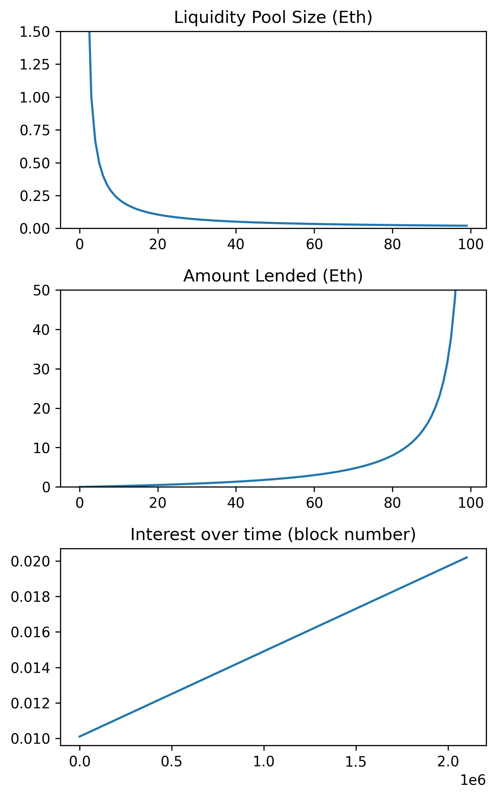

## Simple DeFi Lending Protocol Proof of Concept 

How it works:

1) Users can deposit Eth and earn interest.
2) Users can take out a loan in Eth, but will have to pay interest. 

In return for providing liquidity, users are given ERC20 tokens that have a 1 to 1 peg to Eth. Depositers can redeem these tokens for Eth at a later date. 

The interest accruded by the contract is split proportionally between liquidity providers. 

Currently there is no functionality of providing collateral, therefore, the contract currently is depending on good faith, however, I may choose to implement functionality that requires users to provide colateral to take out a loan from the contract. 

Check out docs/interest.ipynb to see the logic of how interest is calculated in the smart contract

## Interest as a function of liquidity pool size, current amount lended, and time

